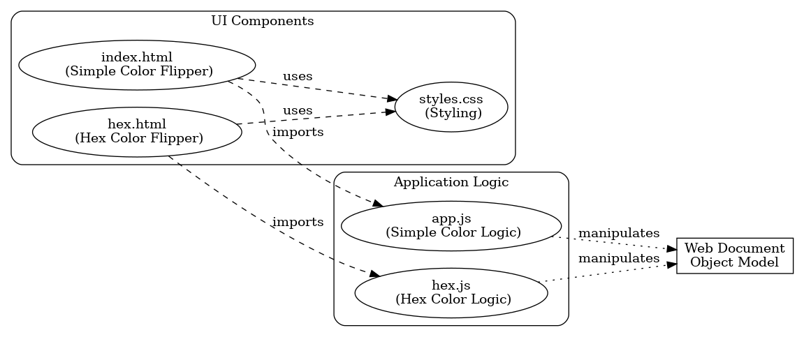

# Color Flipper Website

## Description

Color Flipper is a simple JavaScript web application that allows users to change the background color of the webpage by clicking a button. The application features two modes: a simple color flipper and a hex color generator.

## Features

- Click the button to change the background color to a random color from a predefined list.
- Navigate between the simple color flipper and hex color generator using the navigation links.
- Responsive design that works on both desktop and mobile devices.

## Technologies Used

- HTML
- CSS
- JavaScript

## Getting Started

1. Clone the repository:

   ```bash
   git clone https://github.com/yourusername/color-flipper.git

   ```

2. Navigate to the project directory

   ```bash
   cd color-flipper


   ```

3. Open `index.html` in your web browser to view the application.

```
## Flowchart


```
